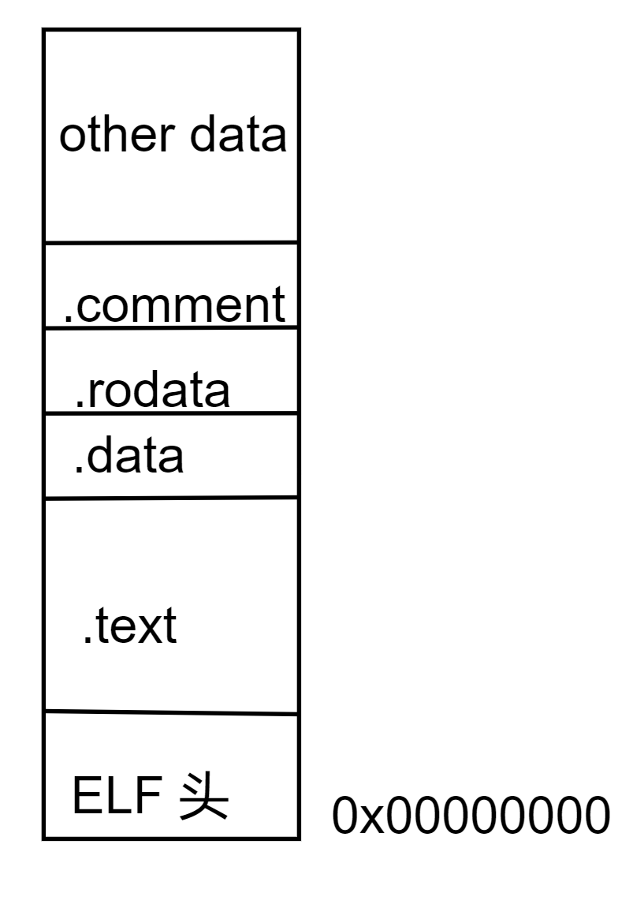
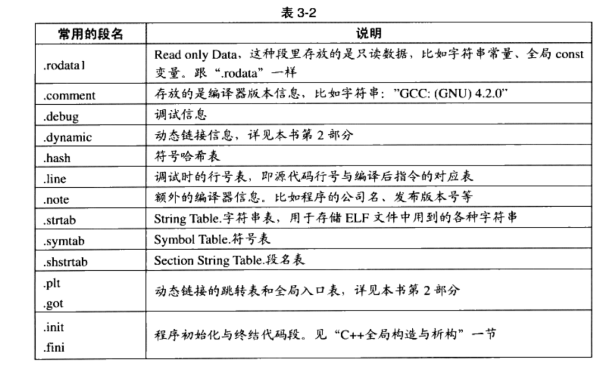
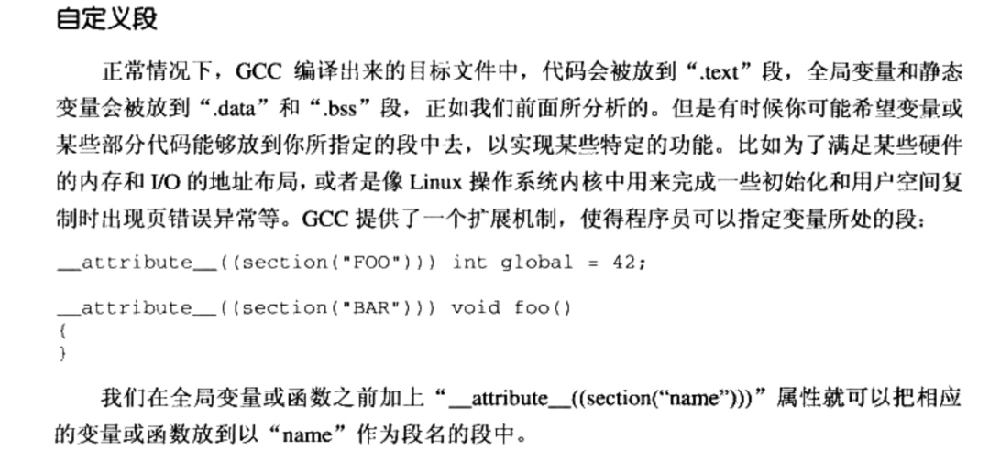

## 1. 编译过程

​	编译分为四步：预处理、编译、汇编、链接

### 1.1 预处理

* 将所有的`#define`删除，展开所有的宏定义

* 处理所有的条件编译。例如：`#ifdef`、`#if`、`#endif`等
* 处理`#include`将包含的文件插入到该预编译指定的位置。这个过程是递归的，被包含的文件可能也包含其他文件
* 删除所有的注释

### 1.2 编译

​	将预处理后的文件编译为汇编文件，文件后缀为.s

### 1.3 汇编

​	将汇编代码转换成机器指令，每一条汇编都对应一条机器指令，生成的文件称为目标文件，后缀为.o

### 1.4 链接

​	链接本质就是将各个.o模块拼凑成可执行文件

​	链接的主要过程包括：地址和空间分配、符号决议、重定位等

​	比如：程序模块main.c中使用另外一个模块func.c中的函数fooc()，在main.c中调用fooc都必须要知道fooc这个函数的地址，但由于模块都是单独编译，编译器在编译main.c的时候并不知道fooc函数地址，将该地址写为0。等到链接的时候，由链接器将fooc地址修正。这个过程称为重定位。

## 2.目标文件

### 2.1 目标文件内容

目标文件将信息分为不同的段，按照段进行存储

* 代码段：存放编译后的机器指令，常见名字有.code或者.text
* 数据段：存放全局变量和局部的静态变量，名字为.data
* .bss段：存放未初始化的全局变量和局部的静态变量
* 只读数据段(.rodata)：存放只读数据，如const修饰的变量，字符常量有时会放在.data段，有时放在.rodata段
* 注释信息段(.commet)
* 堆栈提示段

​	总体来说，目标文件被分为两种段：程序指令和程序数据。代码段属于程序指令，数据段和.bss段属于程序数据

注意：.bss段只是为未初始化的全局变量和局部静态变量预留位置，他并没内容，也不占据空间

​	原因：未初始化的全局变量和局部静态变量的值默认为0，将他们放入.data段，分配空间是没有必要的。而他们只在程序运行时才会占据空间，所以用.bss段来记录他们的大小总和。

> 初始化为0的全局变量或局部静态变量也会放入.bss段

分段好处：

1. 当程序被加载时，数据和指令分别为两段不同空间。数据段程序是可以进行读写的，而代码段为只读的，所以可以为这两个空间设置不同的权限。避免代码指令被意外修改
2. 当程序被多个进程加载时，只需要为他们分配一份指令段。节省内存

### 2.2 其余段和自定义段

### 2.3 文件头

​	文件头定义了ELF的魔数、机器类型、数据存储方式、版本、运行平台、ELF重定位、硬件平台、程序头入口和长度、段表位置和长度以及段数量等信息

​	ELF魔数：操作系统用魔数来确认文件的类型，在加载可执行文件时会确认魔数是否正确，不正确会拒绝加载。魔数还记载着ELF文件为32位还是64位的，为大端还是小端，ELF的版本号等信息

### 2.4段表

​	段表是除了文件头以外最重要的结构，它描述ELF的各个段信息，如：段名、段长、偏移地址、读写权限等其他属性。编译器、链接器都是依靠段表来定位和访问各个段的属性。

​	段表的位置由文件头中的一个成员记录 

​	段表用一个结构体描述每个段、一个结构体对象对应一个段。结构体记录了：段名、段的类型、标志、被加载后的虚拟地址、偏移、长度、段的链接信息、段地址对其等信息。

* 段属性：段名只在编译和链接过程中有意义，对于编译器来说决定段的属性的是段的类型和段的标志。编译器根据类型值区分是.data段还是.text段。
* 段标志：表示该段在进程虚拟地址中的属性，例如：是否可写，是否可执行
