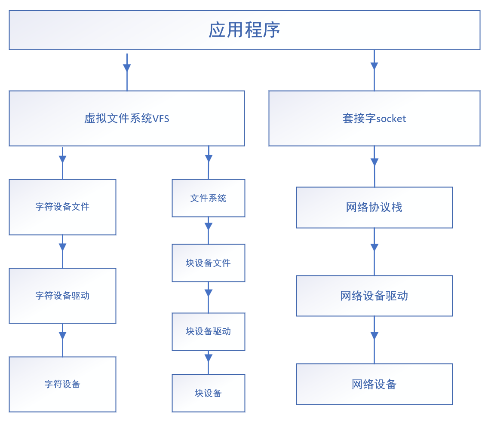

### 一、基础知识

#### 1. 模块编程与应用编程的比较

|          |            内核模块            |         应用程序         |
| :------: | :----------------------------: | :----------------------: |
| API来源  |       不能使用任何库函数       |    各种库函数都能使用    |
| 运行空间 |            内核空间            |         用户空间         |
| 运行权限 |          SVC特权模式           |        非特权模式        |
| 运行方式 |  模块中的函数被使用时需要调用  |    从main函数开始执行    |
| 浮点支持 |        不支持浮点数运算        |      支持浮点数运算      |
| 并发考虑 | 需要考虑多种执行流的并发的竞态 | 只需考虑多任务并行的竞态 |
| 程序出错 |      可能导致整个系统崩溃      |      只会让自己崩溃      |


#### 2. Linux对内核设备的分类

##### 2.1Linux的文件种类

- -：普通文件
- d：目录文件
- p：管道文件
- s：socket文件
- l：链接文件
- c：字符设备
- b：块设备


##### 2.2 文件框架

1. 文件内容
2. 文件名
3. 元信息 inode

使用结构体对象描述


> 其中普通文件、目录文件、链接文件有文件内容，其余文件没有文件内容


##### 2.3 驱动设备分类

* 字符设备：按字节形式流进行数据读写的设备，一般没有缓存
* 块设备：按整块进行数据读写的设备，随机访问，有缓存
* 网络设备：针对网络数据收发的设备


##### 2.4 框架图



#### 3. 设备号

内核用设备号来区分设备，设备号是一个无符号32为整数，数据类型为`dev_t`，设备号分为两部分：

* 主设备号：高12位，用来表示驱动程序相同的一类设备
* 次设备号：低20位，用来表示具体的哪个设备


当应用程序打开一个设备文件时，通过设备号来查找定位内核中的设备


##### 3.1 设备号相关的宏

```c
dev_t debno;
int a=251; //主设备号
int b=1;   //次设备号

devno=MKDEV(a,b);//将主设备号和次设备号组合成32位完整的设备号

a=MAJOR(devno);  //分离出主设备号
b=MINOR(devno);  //分离出次设备号
```


### 二、创建字符设备文件

```shell
cd /dev
mknod 设备文件名 设备种类(c为字符设备，b为块设备) 主设备号 次设备号

#例如：
sudo mknod led c 251 10
```


### 三、设备号接口函数

#### 1.申请设备号

##### 1.1申请指定设备号

```c
int register_chrdev_region(dev_t devno,unsigned count,const char *name);
```

功能：手动分配设备号，如果该设备号没有被占用，则申请该设备号

参数：

**devno**---自己指定的设备号

**count**---申请的设备数量

**name**---在/proc/devices文件中与该设备对应的name

返回值：成功返回0，失败返回错误码


##### 2.2 随机分配设备号

```c
int alloc_chrdev_region(dev_t *dev,unsigned baseminor,unsigned count,const char *name);
```

功能：动态分配设备号

参数：

**dev**---分配成功后的设备号保存地址

**baseminor**---起始的次设备号，一般为0

**count**---申请设备数量

**name**---在/proc/devices文件中与该设备对应的name


#### 2.注销设备号

```c
void unregister_chrdev_region(dev_t dev,unsigned count);
```

功能：释放设备号

参数：

**dev**---已成功分配的设备号

**count**---设备数量


> 释放后在/proc/devices文件中对应的记录消失


### 四、字符设备注册与注销

#### 1.注册字符设备

步骤：

1. 直接定义：定义一个cdev的全局变量
2. 对结构体初始化：

     ```c
     void cdev_init(struct cdev *cdev, const struct file_operations *fops);
     ```

3. 向系统添加字符设备

```c
int cdev_add(struct cdev *p, dev_t dev, unsigned count);
```

参数说明：

p---cdev结构体指针

dev---设备号

count---申请设备数量


例如：

```c
struct cdev mydev;
struct file_operations ops={
    .owner=THIS_MODULE,
    ......
};

cdev_init(&mydev,&ops);
```


`struct cdev结构体`

```c
struct cdev
{
	struct kobject kobj;//表示该类型实体是一种内核对象
	struct module *owner;//填THIS_MODULE，表示该字符设备从属于哪个内核模块
	const struct file_operations *ops;//指向空间存放着针对该设备的各种操作函数地址
	struct list_head list;//链表指针域
	dev_t dev;//设备号
	unsigned int count;//设备数量
};
```

`struct file_operations`结构体声明：

```c
struct file_operations 
{
   struct module *owner;  //填THIS_MODULE，表示该结构体对象从属于哪个内核模块
   int (*open) (struct inode *, struct file *);	//打开设备
   int (*release) (struct inode *, struct file *);	//关闭设备
   ssize_t (*read) (struct file *, char __user *, size_t, loff_t *);	//读设备
   ssize_t (*write) (struct file *, const char __user *, size_t, loff_t *);    //写设备
   loff_t (*llseek) (struct file *, loff_t, int);		//定位
   long (*unlocked_ioctl) (struct file *, unsigned int, unsigned long);//读写设备参数，读设备状态、控制设备
   unsigned int (*poll) (struct file *, struct poll_table_struct *);	//POLL机制，实现多路复用的支持
   int (*mmap) (struct file *, struct vm_area_struct *); //映射内核空间到用户层
   int (*fasync) (int, struct file *, int); //信号驱动
   //......
};
```


#### 2.注销字符设备

```c
void cdev_del(struct cdev *p);
```


例子

```c
#include <linux/module.h>
#include <linux/kernel.h>
#include <linux/kdev_t.h>
#include <linux/fs.h>
#include <linux/types.h>

dev_t mydev=200;

static int mychar_open(struct inode *inode, struct file *filp)
{
	return 0;
}
static int mychar_release(struct inode *inode, struct file *filp)
{
	printk("close mychar\n");
	return 0;
}

struct file_operations ops={
	.owner = THIS_MODULE,
	.open = mychar_open,
	.release = mychar_release
};

static int __init mychar_init(void)
{
	int ret;
	ret=register_chrdev_region(mydev,1,"mychar");	
	if(ret!=0)
	{
		alloc_chrdev_region(&mydev,0,1,"mychar");
	}
	

	register_chrdev(mydev,"mychar",&ops);
	return 0;
}

static void __exit mychar_exit(void)
{
	unregister_chrdev(mydev,"mychar");

	unregister_chrdev_region(mydev,1);
}

module_init(mychar_init);
module_exit(mychar_exit);
MODULE_LICENSE("GPL");//表明遵守GPL协议
```


### 五、操作函数

```c
int (*open) (struct inode *, struct file *);	//打开设备

int (*release) (struct inode *, struct file *);	//关闭设备

ssize_t (*read) (struct file *, char __user *, size_t, loff_t *);	//读设备

ssize_t (*write) (struct file *, const char __user *, size_t, loff_t *);    //写设备

loff_t (*llseek) (struct file *, loff_t, int);		//数据操作位置的定位

long (*unlocked_ioctl) (struct file *, unsigned int, unsigned long);//读写设备参数，读设备状态、控制设备

unsigned int (*poll) (struct file *, struct poll_table_struct *);//POLL机制，实现对设备的多路复用方式的访问
  
int (*fasync) (int, struct file *, int); //信号驱动

```

