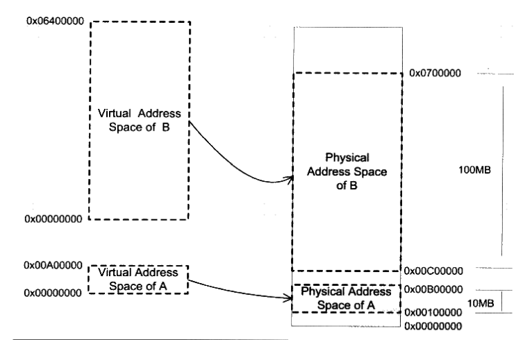
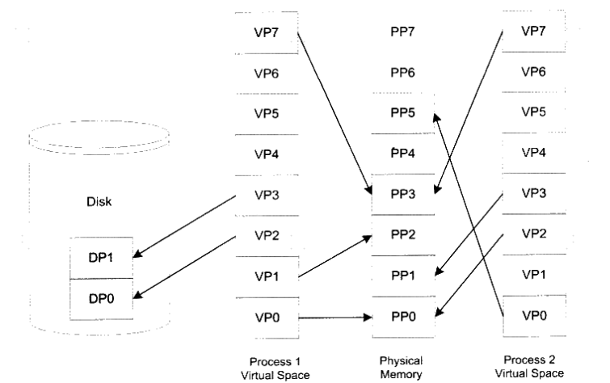

指针：定义指针时，编译器并不为指针所指向的对象分配空间，而是分配指针本身的空间，除非是在定义时同时赋给指针一个字符串常量。

> 赋给指针的字符串常量不能改变


动态链接：程序运行时，才能找到函数库。

静态链接：将函数库链接进文件中。


## volatile关键字

编译器优化方法：将内存变量缓存到寄存器、调整指令顺序充分利用CPU流水线

由于CPU读取寄存器比访问内存速度快很多，所以编译器一般会减少CPU读取内存的优化，当使用volatile时，要求CPU每次读取都从内存读取该变量

使用场景：

1.定义的变量会在程序外改变，要求CPU每次都从内存读取，而不使用缓存在寄存器的值.

2.中断服务程序中，修改供其他程序检测的变量.

```c
static int i=0;
int main()
{
    if(i==1)
    {
        do_something();
    }
    return 0;
}

void ISR_2(void)
{
    i=1;
}
```

程序的本意是希望ISR_2中断产生时，在main函数中调用do_something函数，但是，由于编译器判断在main函数里面没有修改过i，因此可能只执行一次对从i到某寄存器的读操作，然后每次if判断都只使用这个寄存器里面的“i副本”，导致do_something永远也不会被调用。如果将变量加上volatile修饰，则编译器保证对此变量的读写操作都不会被优化。


# 计算机内存管理单元(MMU)

如何将计算机上有限的内存分配给多个程序使用？

假如计算机128MB内存，程序A需要10MB，程序B需要10MB，如果同事运行A和B，将内存前10MB给程序A，10MB~110MB分配给B。

问题：

* 地址空间不隔离，所有程序都能直接访问物理地址，很容易修改其他程序的数据
* 内存使用效率低
* 程序运行时的地址不确定


## 地址隔离

**分段**：把一段与程序所需要的内存空间大小的虚拟空间映射到某个地址空间。

比如：程序A需要10MB，那么假设有一个地址从0X00000000到0X00A000000的10MB大小的虚拟空间，然后我们从实际的物理地址中分配一个相同大小的物理地址。将两个地址一一映射。当程序A中访问地址0X00001000时，CPU会将地址转换成实际的物理地址。



缺点：内存效率不足，很多数据不需要使用也放入了内存中


分页：将虚拟空间内存按页分割，把常用的数据和代码页加载到内存中，不常用的页保存在磁盘中，需要用到时再从磁盘取出。



可以为每个页设置权限属性，只有操作系统有权限修改这些属性。


[【DIY】树莓派ROS智能小车_Frank学习路上的博客-CSDN博客](https://blog.csdn.net/qq_40344790/article/details/127353700?spm=1001.2101.3001.6650.11&utm_medium=distribute.pc_relevant.none-task-blog-2~default~BlogCommendFromBaidu~Rate-11-127353700-blog-117173141.pc_relevant_3mothn_strategy_and_data_recovery&depth_1-utm_source=distribute.pc_relevant.none-task-blog-2~default~BlogCommendFromBaidu~Rate-11-127353700-blog-117173141.pc_relevant_3mothn_strategy_and_data_recovery&utm_relevant_index=16)