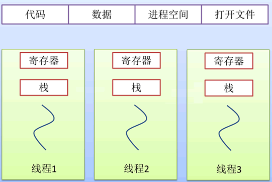

# 3.线程

一、线程基本概念
---
一个进程指的是一个正在执行的应用程序。线程的功能是执行应用程序中的某个具体任务，比如一段程序、一个函数等。

> 进程仅负责为各个线程提供所需的资源，真正执行任务的是线程，而不是进程。

每个进程执行前，操作系统都会为其分配所需的资源，包括要执行的程序代码、数据、内存空间、文件资源等。一个进程至少包含 1 个线程，可以包含多个线程，所有线程共享进程的资源，各个线程也可以拥有属于自己的私有资源。

下图描述了进程和线程之间的关系：



----------

二、线程基本函数
---


|           |    进程     |        线程         |
| :-------: | :--------: | :----------------: |
| 标识符类型 |  `pid_t`   |    `pthread_t`     |
|   获取id   | `getpid()` |  `pthread_self()`  |
|    创建    | ` fork() ` | `pthread_create()` |


### 1、创建线程

```c
#include<pthread.h>
int pthread_create(pthread_t *tidp,const pthread_attr_t *attr,void *(*start_rtn)(void*),void *arg);
//若线程创建成功，则返回0。若线程创建失败，则返回出错编号，并且*thread中的内容是未定义的。
```
参数说明：
**tidp**--指向线程标识符的指针。
**attr**--用来设置线程属性，一般默认NULL。
**start_rtn**--线程运行函数的起始地址。
**arg**--传递给运行函数的参数。

**注意**：因为pthread并非Linux系统的默认库，而是POSIX线程库。在Linux中将其作为一个库来使用，因此加上`-lpthread`以显式链接该库。函数在执行错误时的错误信息将作为返回值返回，并不修改系统全局变量errno，当然也无法使用perror()打印错误信息。

编译：
>gcc -o pthread pthread.c  -lpthread

用法示例：
```c
#include<stdio.h>
#include<unistd.h>
#include<pthread.h>

void *mypthread(void* arg)
{
    if(arg==NULL){
        printf("arg is NULL\n");
    }   
    printf("arg=%s\n",(char*)arg);
    return NULL;
}

int main ()
{
    int ret;
    char a[]="hello world";
    pthread_t tidp;
    ret=pthread_create(&tidp,NULL,mypthread,a);
    if(ret!=0){
        printf("create failed\n");
    }   
    sleep(1);//令主线程等到子线程执行完成
    printf("this is main\n");
    return 0;
} 
```
查看线程是否运行：`ps -eLf|grep 程序名`

----------

#### 2、获取id号

```c
#include <pthread.h>
pthread_t pthread_self(void);
//返回线程自身的ID
```
注意：打印时使用%lu

----------

#### 3、线程的退出

```c
void pthread_exit(void *retval);
```
参数说明：
**retval** 是 void* 类型的指针，可以指向任何类型的数据，它指向的数据将作为线程退出时的返回值。如果线程不需要返回任何数据，设置为 NULL 。

注意：`return` 语句和 `pthread_exit()` 函数的含义不同，return 的含义是返回，它不仅可以用于线程执行的函数，普通函数也可以使用；`pthread_exit()` 函数的含义是线程退出，它专门用于结束某个线程的执行。

----------

#### 4、线程回收

```c
int pthread_join(pthread_t thread, void ** retval);
//成功返回0，失败返回不同的宏
```
参数说明：
**thread** --用于指定接收哪个线程的返回值
**retval** --表示接收到的返回值，没有返回值设置为NULL

> `pthread_join()` 函数会一直阻塞调用它的线程，直至目标线程执行结束（接收到目标线程的返回值），阻塞状态才会解除。


```c
int pthread_detach(pthread_t thread);
//成功返回0，失败返回-1
```
函数功能：设置线程为分离属性，线程结束后自动回收资源

> 线程为默认属性时需要使用`pthread_join()`进行回收

示例：
```c
#include<stdio.h>
#include<unistd.h>
#include<pthread.h>
#include<stdlib.h>
#include<string.h>

typedef struct{
    int a;
    int b;
    char buf[20];
}mystr;
mystr *p;

void *myfun(void *arg)
{
    p=(mystr*)malloc(sizeof(mystr));//注意p不能指向局部变量
    if(p==NULL){
        printf("malloc is failed\n");
        return NULL;
    }
    p->a=1;
    p->b=2;
    memcpy(p->buf,"hello world",12);

    if(arg==NULL){
        printf("arg is NULL\n");
    }
    else{
        printf("arg is %s\n",(char*)arg);
    }

    pthread_exit(p);
}

int main(int argc,char *argv[])
{
    pthread_t tid;
    int ret;

    ret=pthread_create(&tid,NULL,myfun,(void*)argv[1]);
    if(ret!=0){
        printf("pthread create failed\n");
        return -1;
    }

    sleep(1);
    ret=pthread_join(tid,(void **)&p);
    if(ret==0){
        printf("pthread is join\n");
    }
    else{
        printf("pthread join failed\n");
    }

    printf("a=%d,b=%d,buf=%s\n",p->a,p->b,p->buf);
    free(p);
    p=NULL;
    return 0;
}
```
----------

#### 5、线程的取消

```c
int pthread_cancel(pthread_t thread);
//成功返回0，失败返回宏
```
函数说明:
* **thread** 用于指定发送 Cancel 信号的目标线程。
* 线程的取消一定要有取消点(阻塞的系统调用)才可以  例如：sleep函数

> 该函数是向目标线程发送cancel信号，至于目标线程是否处理该信号以及何时结束执行，由目标线程决定

注意：线程被取消后仍需要使用`pthread_join()`回收资源

----------

#### 6、取消点

①改变函数对信号的反应
```c
int pthread_setcancelstate(int state,int *oldstate) 
//成功返回0，失败返回非0
```
参数说明：
**state**-- `PTHREAD_CANCEL_ENABLE` (默认)和 `PTHREAD_CANCEL_DISABLE` ，
**old_state**-- 不为NULL则存入原来的Cancel状态以便恢复。为空则不存原cencel状态

> 如果**state**是`PTHREAD_CANCEL_ENABLE`则信号立即到达。不是则转化为`PTHREAD_CANCEL_ENABLE`才到达。


②设置取消动作的执行
```c
int pthread_setcanceltype(int type, int *oldtype)
```
参数说明：
**type**--`PTHREAD_CANCEL_DEFFERED`(默认)，`PTHREAD_CANCEL_ASYCHRONOUS`
**old_state**-- 不为NULL则存入原来的Cancel状态以便恢复。为空则不存原cencel状态

> 信号到达后根据cancel type决定何时取消：`PTHREAD_CANCEL_DEFFERED`运行到取消点才取消，`PTHREAD_CANCEL_ASYCHRONOUS`立即取消

③设置取消点
```c
void pthread_testcancel(void)
```
<mark>注意：引起阻塞的系统调用和C函数库都是取消点</mark>


----------

#### 7、线程的清理

当线程**异常退出**时，进行资源释放。
```c
void pthread_cleanup_push(void (*routine)(void *),void *arg);
void pthread_cleanup_pop(int execute);    
```
<mark>注意：两个函数必须成对出现</mark>

参数说明：
**routine**--回调函数
**arg**--传递给回调函数的参数
**execute**--为0时，删除回调函数


回调函数执行条件：
* 调用`pthread_exit()`
* 响应取消时候
* execute参数为非零时

----------

三、线程的同步
---
当多个线程对共享资源进行操作时，需要通过特定的设置来控制线程之间的先后执行顺序的过程，称为线程同步

#### 1、互斥量

每个线程在访问共享资源前先尝试**对互斥量进行设置(加锁)**，成功加锁后才可以对共享资源进行读写操作，操作结束后**释放互斥量(解锁**)。

> 对互斥量进行加锁之后，任何其他试图再次对互斥量进行加锁的线程都会被阻塞直到当前线程释放该互斥锁

##### 1.1 创建互斥量

```c
int pthread_mutex_init(pthread_mutex_t *restrict mutex,const pthread_mutexattr_t *restrict attr);
//成功返回0，失败返回非0
```
参数说明：
**mutex**--指向互斥变量的指针
**attr**:--互斥量属性。如果设置为NULL，表示使用默认的属性初始化互斥量。

示例：
```c
pthread_mutex_t mutex;
pthread_mutex_init(&mutex,NULL);
```

##### 1.2 加锁、解锁

```c
int pthread_mutex_lock(pthread_mutex_t *mutex);//阻塞
int pthread_mutex_unlock(pthread_mutex_t *mutex);
int pthread_mutex_trylock(pthread_mutex_t *mutex)//非阻塞
```

##### 1.3 锁的销毁

```c
int pthread_mutex_destroy(pthread_mutex_t *mutex);
```
----------

#### 2、条件变量

在线程之间有一种情况：线程A需要某个条件才能继续往下执行，如果该条件不成立，此时线程A进行阻塞等待，当线程B运行后使该条件成立后，则唤醒该线程A继续往下执行。

##### 2.1 创建条件变量

```c
int pthread_cond_init(pthread_cond_t *restrict cond,pthread_condattr *restrict attr);
//初始化条件变量
```
**attr**--条件变量属性，通常为默认值，传NULL即可

##### 2.2 等待条件变量

```c
int pthread_cond_wait(pthread_cond_t *restrict cond, pthread_mutex_t *restrict mutex);
```
函数说明：
1. 阻塞等待条件变量cond（参数1）满足。
2. 释放已掌握的互斥锁(解锁互斥量)相当于 `pthread_mutex_unlock(&mutex);`
3. 当被唤醒，`pthread_cond_wait()`返回时，解除阻塞并重新申请获取互斥锁`pthread_mutex_lock(&mutex);`

##### 2.3 唤醒

```c
int pthread_cond_signal(pthread_cond_t *cond);//唤醒一个进程
int pthread_cond_broadcast(pthread_cond_t *cond);//唤醒所有进程
```

示例：
```c
#include<stdio.h>
#include<unistd.h>
#include<stdlib.h>
#include<pthread.h>

pthread_mutex_t mutex;
pthread_cond_t cond;
typedef struct node{
    int date;
    struct node *next;
}sqlist,*listlink;
listlink p=NULL;

void *producer(void* arg)
{
    listlink L;
    int i=1;

    while(1){
        L=(listlink)malloc(sizeof(sqlist));
        if(L==NULL){
            printf("malloc failed\n");
            return (void*)-1;
        }
        pthread_mutex_lock(&mutex);
        L->date=i;
        L->next=p;
        p=L;
        printf("produce %d\n",i);
        pthread_cond_signal(&cond);
        pthread_mutex_unlock(&mutex);
        i=i+1;
        sleep(1);
    }

}

void *costumer(void* arg)
{
    listlink q;

    sleep(4);
    while(1){
        pthread_mutex_lock(&mutex);
        while(p==NULL){
            pthread_cond_wait(&cond,&mutex);
        }
        printf("cotumer %d\n",p->date);
        q=p;
        p=p->next;
        free(q);
        q=NULL;
        pthread_mutex_unlock(&mutex);
        sleep(1);
    }

}

int main()
{
    pthread_t tid1,tid2;
    int ret;

    pthread_mutex_init(&mutex,NULL);
    pthread_cond_init(&cond,NULL);

    ret=pthread_create(&tid1,NULL,producer,NULL);
    if(ret!=0){
        printf("create producer failed\n");
        return -1;
    }
    ret=pthread_create(&tid2,NULL,costumer,NULL);
    if(ret!=0){
        printf("create costumer failed\n");
        return -1;
    }

    while(1)
    {
        sleep(1);
    }
}

```