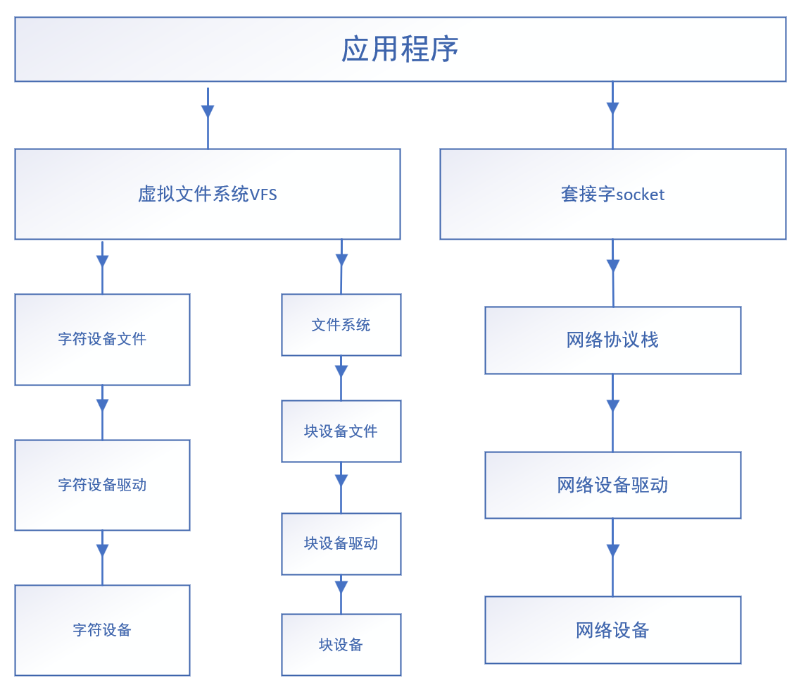

### 一、基础知识

#### 1. 模块编程与应用编程的比较

|          |            内核模块            |         应用程序         |
| :------: | :----------------------------: | :----------------------: |
| API来源  |       不能使用任何库函数       |    各种库函数都能使用    |
| 运行空间 |            内核空间            |         用户空间         |
| 运行权限 |          SVC特权模式           |        非特权模式        |
| 运行方式 |  模块中的函数被使用时需要调用  |    从main函数开始执行    |
| 浮点支持 |        不支持浮点数运算        |      支持浮点数运算      |
| 并发考虑 | 需要考虑多种执行流的并发的竞态 | 只需考虑多任务并行的竞态 |
| 程序出错 |      可能导致整个系统崩溃      |      只会让自己崩溃      |


#### 2.程序框架

```c
#include <linux/module.h>
#include <linux/kernel.h>

int __init xxxx_init(void)
{
	    
	return 0;
}

void __exit xxxx_exit(void)
{
    
}

MODULE_LICENSE("GPL");

module_init(xxxx_init);
module_exit(xxxx_exit);
```


#### 3. Linux对内核设备的分类

##### 3.1Linux的文件种类

- -：普通文件
- d：目录文件
- p：管道文件
- s：socket文件
- l：链接文件
- c：字符设备
- b：块设备


##### 3.2 文件框架

1. 文件内容
2. 文件名
3. 元信息 inode

使用结构体对象描述


> 其中普通文件、目录文件、链接文件有文件内容，其余文件没有文件内容


##### 3.3 驱动设备分类

* 字符设备：按字节形式流进行数据读写的设备，一般没有缓存
* 块设备：按整块进行数据读写的设备，随机访问，有缓存
* 网络设备：针对网络数据收发的设备


##### 3.4 框架图



#### 4. 设备号

内核用设备号来区分设备，设备号是一个无符号32为整数，数据类型为`dev_t`，设备号分为两部分：

* 主设备号：高12位，用来表示驱动程序相同的一类设备
* 次设备号：低20位，用来表示具体的哪个设备


当应用程序打开一个设备文件时，通过设备号来查找定位内核中的设备


##### 3.1 设备号相关的宏

```c
dev_t debno;
int a=251; //主设备号
int b=1;   //次设备号

devno=MKDEV(a,b);//将主设备号和次设备号组合成32位完整的设备号

a=MAJOR(devno);  //分离出主设备号
b=MINOR(devno);  //分离出次设备号
```


### 二、创建字符设备文件

```shell
cd /dev
mknod 设备文件名 设备种类(c为字符设备，b为块设备) 主设备号 次设备号

#例如：
sudo mknod led c 251 10
```


### 三、申请和注销设备号

#### 1.申请设备号

##### 1.1申请指定设备号

```c
int register_chrdev_region(dev_t devno,unsigned count,const char *name);
```

功能：手动分配设备号，如果该设备号没有被占用，则申请该设备号

参数：

**devno**---自己指定的设备号

**count**---申请的设备数量

**name**---在/proc/devices文件中与该设备对应的name

返回值：成功返回0，失败返回错误码


##### 2.2 随机分配设备号

```c
int alloc_chrdev_region(dev_t *dev,unsigned baseminor,unsigned count,const char *name);
```

功能：动态分配设备号

参数：

**dev**---分配成功后的设备号保存地址

**baseminor**---起始的次设备号，一般为0

**count**---申请设备数量

**name**---在/proc/devices文件中与该设备对应的name


#### 2.注销设备号

```c
void unregister_chrdev_region(dev_t dev,unsigned count);
```

功能：释放设备号

参数：

**dev**---已成功分配的设备号

**count**---设备数量


> 释放后在/proc/devices文件中对应的记录消失