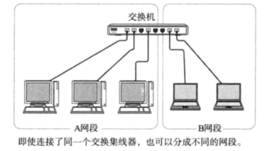
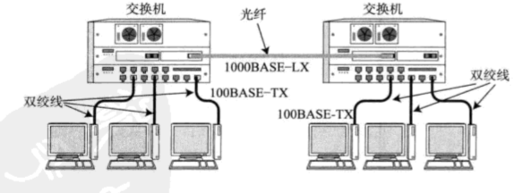
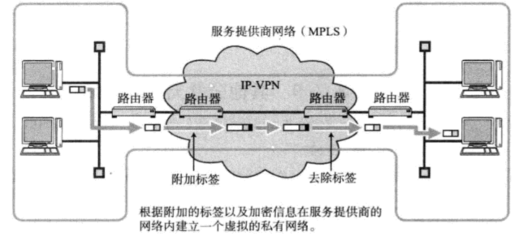

### 1、链路层作用

链路层定义了通过通信媒介互联的设备之间的传输规范。通信媒介包括：双绞线电缆、光纤、电波、红外等。

各个设备之间有时也会通过交换机、网桥、中继器等中转数据

### 2、链路层相关技术

#### 2.1 MAC地址

MAC地址用于识别链路中互联的节点，每个设备唯一。

#### 2.2 MAC地址转发

交换机集线器也叫以太网交换机。持有多个端口的网桥，根据链路层中的每个帧的目标MAC地址，决定从哪个网络接口发送数据

#### 2.3 VLAN

VLAN技术的网桥，能将交换机按照其端口区分多个网段。

#### 2.4 以太网

在链路层中最为著名，使用最为广泛。

#### 2.5 无线通信

使用电磁波、红外线、激光等方式进行数据传输。一般在办公室的局域网范围内组成的较为高速的连接称为无线局域网。

无线通信的分类：

|    分类    |    通信距离     |    技术    |
| :--------: | :-------------: | :--------: |
| 短距离无线 |      数米       |   RF-ID    |
|  无线PAN   |    10米左右     |    蓝牙    |
|  无线LAN   |    100米左右    |   Wi-Fi    |
|  无线MAN   | 数千米~100千米  |   WiMAX    |
|  无线RAN   | 200千米~700千米 |            |
|  无线WAN   |                 | 3G、4G、5G |

#### 2.6 VPN

虚拟专用网络(VPN)用于连接距离较远的低于，这种服务包括IP-VPN和广域以太网

* IP-VPN：指在IP网络(互联网)上建立VPN

​		网络服务商提供的一种在IP网络上使用MPLS技术构建的VPN服务，在IP包中附加一个标签的信息进行传输，每个用户的标签信息不同，因此通过MPLS网时，可以轻松的判断出目标地址。这样就可以将多个不同用户的VPN信息通过MPLS网加以区分，形成封闭的私有网络。

​		有些公司可以在互联网上建立自己的VPN，对IP包进行验证和加密，形成封闭的私有网络。

* 广域以太网	

  服务商提供的用于连接距离远的服务，使用VLAN实现的VPN技术，只要指定同一个VLAN。无论从哪里都能接入到同一个网络。