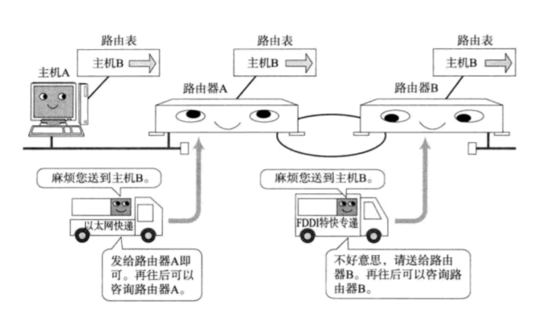

## 1. IP基础知识

三大作用模块：

* IP寻址
* 路由
* IP分包与组包

### 1.1 IP地址

用于在连接到网络中的所有主机中识别出进行通信的目标地址。与网络层中MAC地址类似。

注意：MAC地址用来识别同一个链路中不同计算机，IP地址用于识别连接到网络中的不同计算机

### 1.2 IP地址的定义

​		IP地址(IPv4)由32为整数标识，由网络和主机两部分标识组成。

### 1.3 广播地址

​		用于在同一个链路中相互连接的主机之间发送数据包。广播地址是将IP地址中的主机位全部设置为1，例如：192.168.0.0/16的广播地址为192.168.0.255/16

​		广播分为本地广播和直接广播。

​		在本网络内的广播叫做本地广播，例如L92.168.0.0/24的广播地址为192.168.0.255。路由器会对广播地址包进行屏蔽，所以数据包不会到达192.168.0.0以外的链路上。

​		在不同网络之间的广播叫做直接广播，例如：网络地址为192.168.0.0 的主机想192.168.1.255的目标地址发送IP包，路由器将数据转发给192.168.1段，该网段的所有主机都能收到这个数据包

### 1.4 子网掩码

​		网络标识部分子网掩码全为1，主机部分子网掩码全为0

### 1.5 全局地址

​		由于IP地址不足，所以出现一种新的技术，不一定非要为每台设备或路由器分配一个固定的IP地址，而是在必要的时候只为相应数量的设备分配唯一的IP地址。

​		私有网络的IP地址：10.0.0.0~10.255.255.255、172.16.0.0~172.31.255.255、192.168.0.0~192.168.255.155 包含在这个范围内的IP都属于私有IP，当NAT技术诞生以后，私有IP地址也能与全局地址的主机实现通信

​		全局IP地址：在整个互联网范围内保持唯一

​		

## 2 路由控制

​		路由控制是指将分组数据发送到最终目标地址的功能，网络连接非常复杂，需要路由控制来界定到达目标地址的通路。

​		路由表：路由表记录了IP数据下一步应该发给哪个路由器，IP包根据路由表在各个数据链路上传输。路由表形成方式有两种：管理员手动设置(静态路由控制)、路由器与其他路由器交换信息时自动刷新(动态路由控制)。

#### 2.1 默认路由

​		默认路由是对IP数据包中的目的地址找不到存在的其他路由时，路由器所选择的路由。当目的地不在路由表里的所有数据包都发往默认路由。默认路由一般标记为0.0.0.0/0。属于静态路由

#### 2.2 主机路由

​		IP地址/32，称为主机路由。意思是整个IP地址的所有位都进行路由。比如：当为某个目的IP搜索路由表时，目的地址必须与IP地址完全一样才进行路由。而网络路由只需要匹配目的地址和子网号就可以。属于静态路由

## 3.相关技术

#### 3.1 DNS

IP地址不方便记忆，DNS技术能将域名解析成IP地址。

#### 3.2 ARP

只要通过IP地址就能查到目的主机的MAC地址

#### 3.3 RARP

ARP反过来，从MAC地址定位IP地址

#### 3.4 DHCP

自动设置IP地址，统一管理IP地址分配，实现即插即用

#### 3.5 NAT

用于在本地网络中使用私有地址，在连接互联网时转而使用全局IP地址的技术