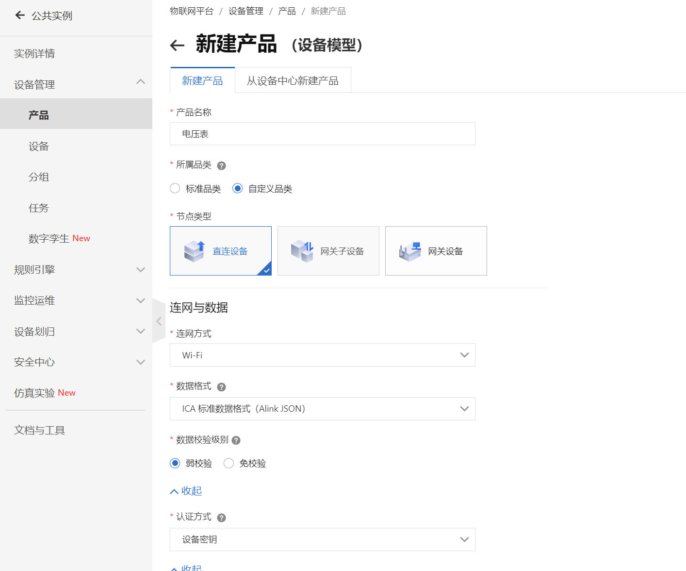
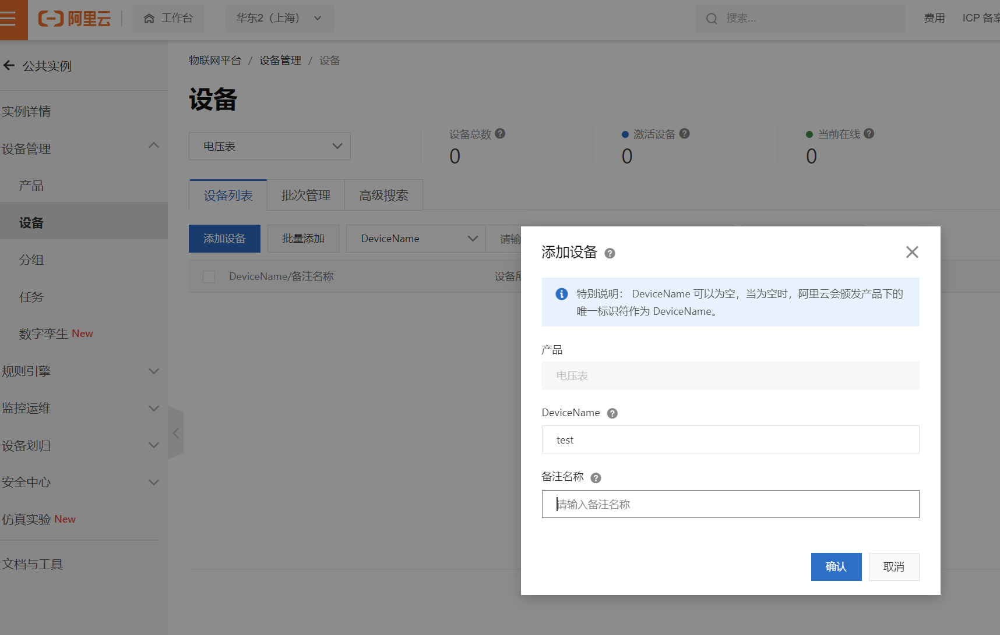
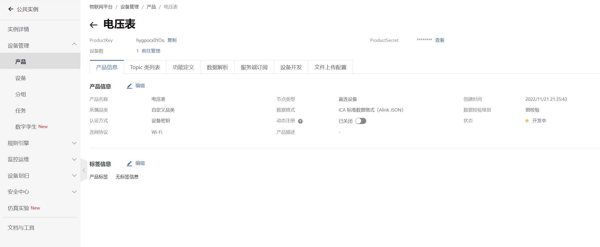
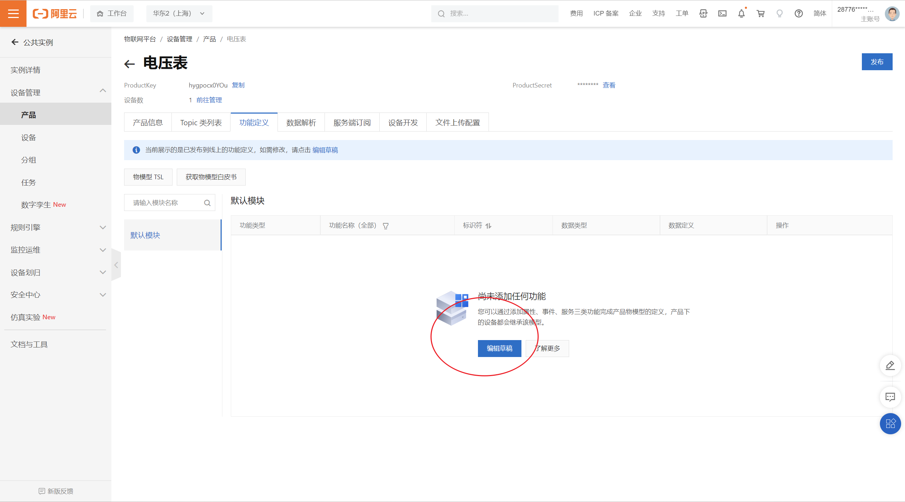
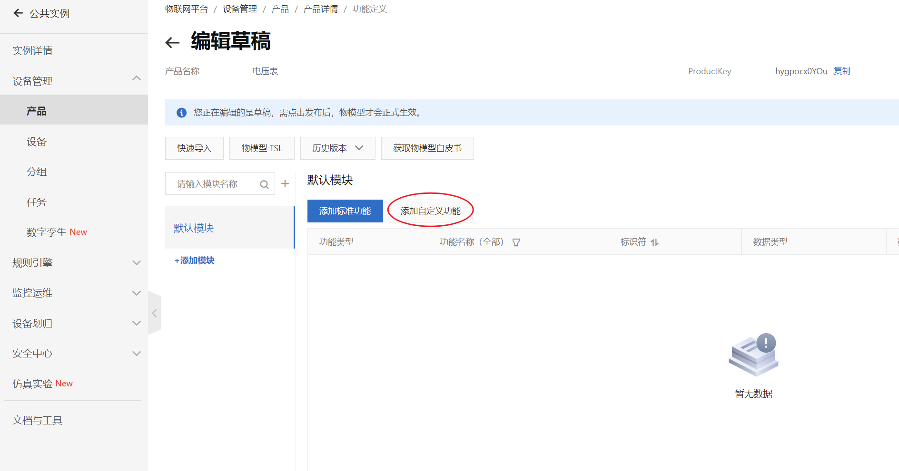
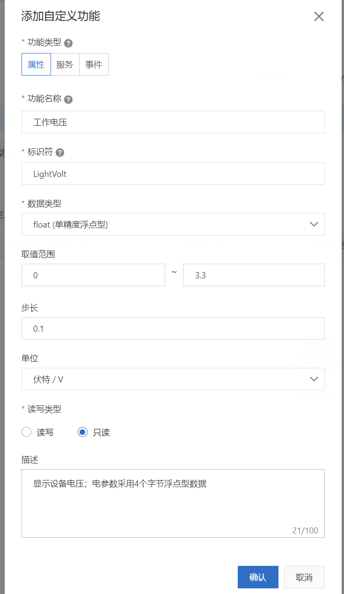
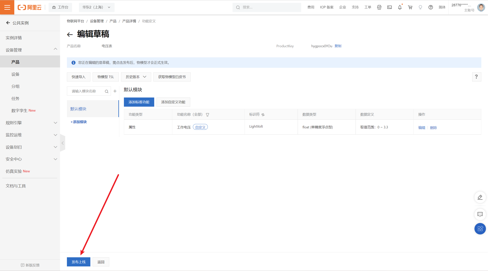

## 一、部署阿里云平台


[阿里云登录页 (aliyun.com)](https://account.aliyun.com/login/login.htm?oauth_callback=https%3A%2F%2Fiot.console.aliyun.com%2F&lang=zh)

### 1.创建产品



### 2.添加设备



### 3.定义产品功能

点击产品---查看进入以下界面：



点击功能定义----编辑草稿------自定义功能







发布上线




> 需要注意的是，新设备创建成功后，设备状态显示未激活，物模型数据为空，使用MQTT模拟器或其他软硬件首次连接成功后，设备将自动激活，设备状态将显示为上线。


## 三、连接阿里云

三种方法：

### 1.移植MQTT官网代码到STM32


### 2.通过抓包工具，配合mqtt.fx(虚拟客户端)，抓取协议头

1. [基于STM32实现MQTT_Mask_T的博客-CSDN博客_mqtt stm32](https://blog.csdn.net/qq_39785798/article/details/80765716)

2. windows下mqtt.fx软件充当客户端步骤：[使用MQTT.fx接入物联网平台 (aliyun.com)](https://help.aliyun.com/document_detail/140507.html?spm=a2c4g.11186623.6.571.1e417544OGPj2y)


### 3.刷固件

正点原子模块使用正点原子自主开发的固件，该固件能通过指令能连接原子云，但并不支持指令连接MQTT，所以刷一个集成MQTT的固件。使用指令就能直接登录MQTT

固件连接MQTT指令：[ESP-AT 系列: AT+MQTT 使用_乐鑫科技 Espressif的博客-CSDN博客_at+mqttpub](https://blog.csdn.net/espressif/article/details/101713780?dist_request_id=1619574106031_67488&depth_1-)

刷固件方法：[ESP8266固件AT指令连接EMQ 的MQTT服务器_Drive World的博客-CSDN博客](https://blog.csdn.net/qq_39758638/article/details/116238916)


```c
#define WIFI xxxx
#define PASSWD xxxxx

char recvbuf[128]={0};//接收缓存
char sendbuf[128]={0};//发送缓存

void mysend(char *str)
{
	HAL_UART_Transmit(&huart1,(uint8_t *)str,strlen(str),0xFFFF);
}

void connect()
{
    memset(sendbuf,0,strlen(sendbuf));//清空发送缓存
    sprintf(sendbuf,"AT+CWJAP=\"%s\",\"%s\"",WIFI,PASSWD);
    mysend(sendbuf);
}

```

